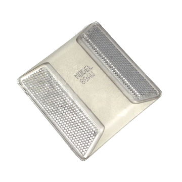
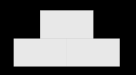

<!-- omit in toc -->
# Race Procedure Rules

- [Disclaimer](#disclaimer)
- [Spirit of the Competition](#spirit-of-the-competition)
- [Race Structure](#race-structure)
- [Race Track definition](#race-track-definition)
- [Obstacle avoidance rules](#obstacle-avoidance-rules)
- [Prior-mapping allowed category](#prior-mapping-allowed-category)
- [Reactive required category](#reactive-required-category)
- [Awards](#awards)

## Disclaimer

These rules are open to interpretation where specifics are not given. This means that, for example, a material is not explicitly stated then that material is not banned as long as it does not break another rule in this section. Other sections may have specificities for those areas.

## Spirit of the Competition

The goal of the Autonomous Karting Series is to create an accessible and exciting autonomous go kart race. The race presents a realistic scenario in which teams need to build go-karts that will race and compete on a track autonomously. It is encouraged that teams will work to create innovative and performant hardware, electrical, and software solutions.

## Race Structure

 1. Two race categories:
    1. Prior-mapping allowed category
    2. Reactive required category
 2. Team rankings will be by total time taken to complete the 5 laps.
 3. Obstacle avoidance will be a part of both categories and will be required.
    1. The exact time penalty for hitting the obstacle will be decided before the race as decided in a competition briefing.
 4. The team order in which each category will be run will be decided at random.

## Race Track definition

 1. The track is defined by both solid lines and [Reflective Pavement Markers](https://ntsigns.com/reflectors/reflective-pavement-markers-rpms/3m-2-way-raised-pavement-marker/).
    
    1. Markers placed along track will be spaced a minimum of 10 feet apart.
 2. Track width must be at minimum 15 feet and a maximum of 20 feet.
 3. The start/finish line will be identified on a per track basis.

## Obstacle avoidance rules

 1. The obstacle is considered a separate entity from the track definition.
 2. Possible placement locations of the obstacle will be determined in the competition briefing prior to the race.
 3. The obstacle’s starting side (left or right side) will be the same for all teams and categories.
 4. Each consecutive lap the obstacle will be swapped to the other side of the track.
 5. The obstacle’s location will not be able to be pre-mapped.
 6. The obstacle will be provided by the race organizers at the race track.
    * 3 cardboard [Home Depot Boxes](https://www.homedepot.com/p/The-Home-Depot-27-in-L-x-15-in-W-x-16-in-D-Large-Moving-Box-with-Handles-LBX/316324894) will be painted white and taped together in a pyramid shape with two boxes forming the base and one placed on top, as shown below:
    

## Prior-mapping allowed category

 1. The spirit of this category is that any data on the track definition from any prior runs or outside track data is allowed to be used throughout the race.
 2. A non-encompassing list of allowed data:
       * GPS waypoints
       * Track centerline

## Reactive required category

 1. The spirit of this category is to prevent prior models of the track definition from being used as an input.
 2. Throughout the race, teams are encouraged to perform mapping during the race.
 3. No __Pre-Mapping__ is allowed to be done prior to starting the race, including:
    * Any representation of the track
    * GPS waypoints
    * Data from a prior to the race start

## Awards

 1. Fastest lap Award
    * The fastest lap overall of the competition completed in any category.
 2. Category Awards
    1. For each category the top 3 teams will receive placement awards.
    2. Placement will be determined by the fastest __Adjusted Total Time__ for each team around the track.
 3. Engineering Excellence Award
    * The awarded team will be selected from judges based on design documents and implementation of components on the kart.